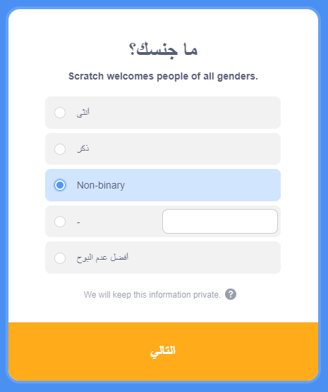

## قم بإنشاء حساب Scratch

- أذهب إلى [scratch.mit.edu](https://scratch.mit.edu).

- انقر فوق الخيار **انضم الى سكراتش** في القائمة.

- سيفتح مربع حوار **انضم الى سكراتش**. أنشئ اسم مستخدم جديدًا وتأكد من أنه ليس اسمك الحقيقي. ثم أنشئ كلمة مرور قوية، تتكون من مزيج بين الأحرف والأرقام والرموز. ثم انقر فوق **التالي**.

- اختر البلد الذي تعيش فيه من القائمة المنسدلة ثم انقر فوق **التالي**.

- حدد الشهر والسنة التي ولدت فيها. ثم انقر فوق **التالي**

- إذا كنت ترغب في ذلك ، حدد جنسك.

- اكتب عنوان بريدك الإلكتروني أو عنوان البريد الإلكتروني لأحد الوالدين.

- انقر فوق **أنشيء حسابك**.

- انقر على **Get Started**.

- في مرحلة ما، ستحتاج إلى الانتقال إلى بريدك الإلكتروني وتأكيد حساب بريدك الإلكتروني.

