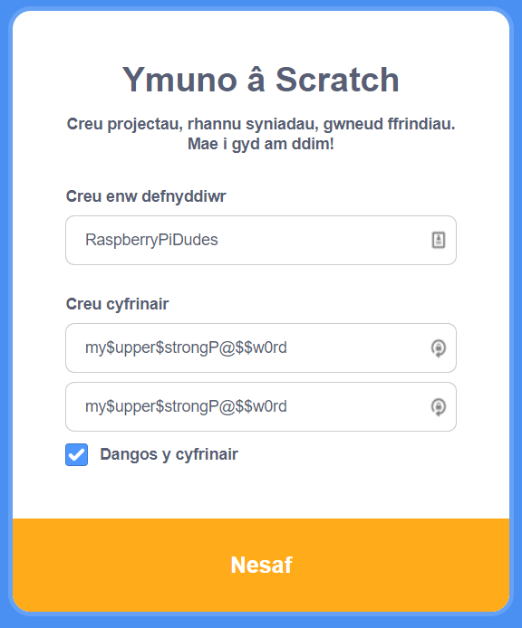
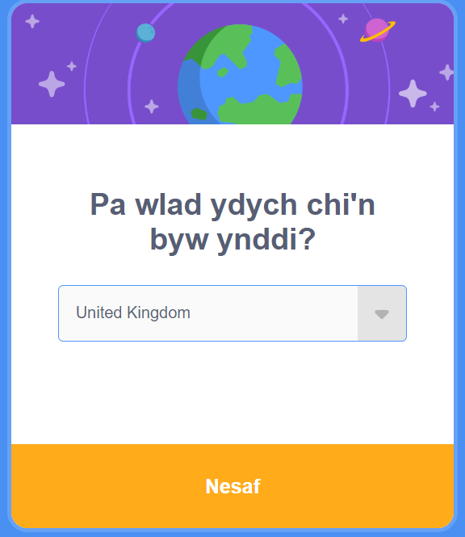
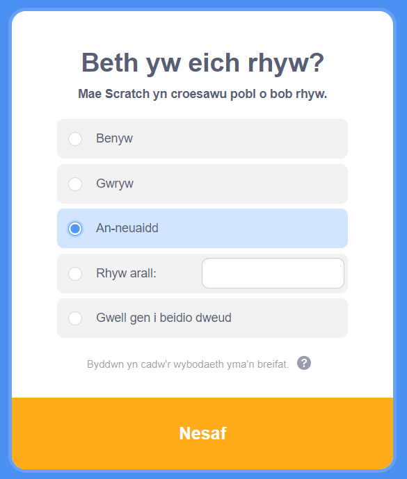
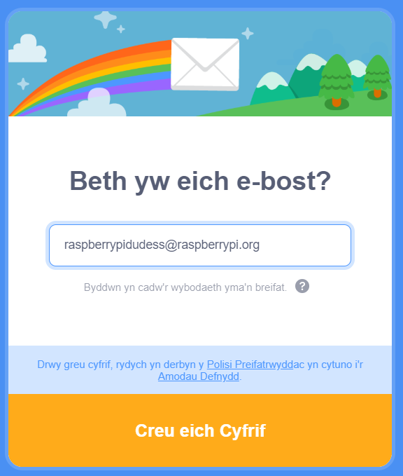
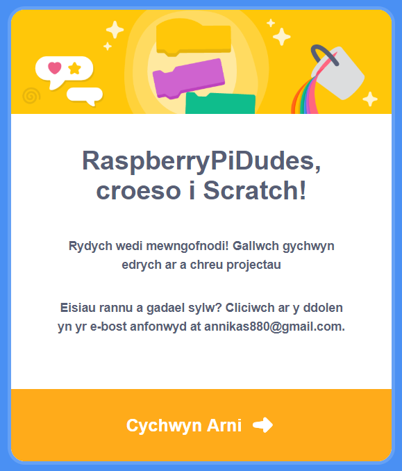

## Creu cyfrif Scratch

- Cer i [scratch.mit.edu](https://scratch.mit.edu)

- Clicia ar y dewis **Ymuno â Scratch** yn y ddewislen.

- Crea enw defnyddiwr newydd, ond paid â defnyddio dy enw go iawn. Yna crea gyfrinair cryf, gan gymysgu nodau, rhifau a symbolau. Wedyn clicia ar **Nesaf**

- Dewisa'r wlad rwyt ti'n byw ynddi o'r gwymplen ac wedyn clicio ar **Nesaf**

- Dewisa'r mis a'r flwyddyn cest ti dy eni

- Dewisa dy rywedd neu, os oes well gen ti, paid â gwneud hynny.

- Teipia dy gyfeiriad e-bost, neu gyfeiriad e-bost rhiant.

- Cliciwch ar **Creu Eich Cyfrif**

- Cliciwch ar **Dechrau Arni**

- Ar ryw bwynt bydd angen i ti fynd i dy e-bost a chadarnhau dy gyfrif e-bost.

