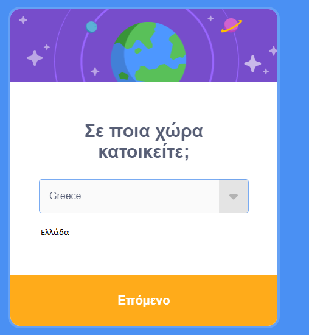
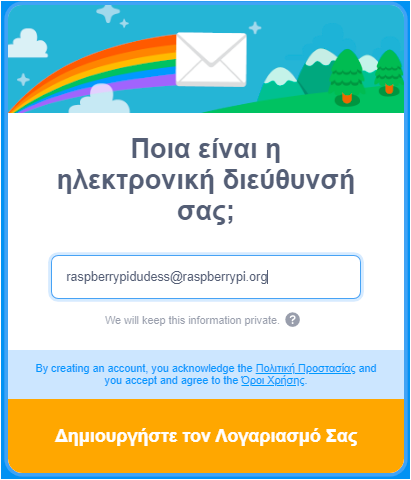

## Δημιούργησε έναν λογαριασμό Scratch

- Πήγαινε στο [scratch.mit.edu](https://scratch.mit.edu).

- Κάνε κλικ στην επιλογή **Εγγραφή στο Scratch** στο μενού.

- Ένα παράθυρο διαλόγου **Εγγραφή στο Scratch** θα ανοίξει. Δημιούργησε ένα νέο όνομα χρήστη και βεβαιώσου ότι δεν είναι το πραγματικό σου όνομα. Στη συνέχεια, δημιούργησε έναν ισχυρό κωδικό πρόσβασης, χρησιμοποιώντας ένα συνδυασμό χαρακτήρων, αριθμών και συμβόλων. Κάνε κλικ στο **Επόμενο**.

- Επίλεξε τη χώρα στην οποία ζείς από το αναπτυσσόμενο μενού και, στη συνέχεια, κάνε κλικ στο **Επόμενο**.

- Επίλεξε τον μήνα και το έτος που γεννήθηκες. Κάνε κλικ στο **Επόμενο**.

- Αν θέλεις, επίλεξε το φύλο σου.

- Πληκτρολόγησε τη διεύθυνση email σου ή τη διεύθυνση email ενός γονέα.

- Κάνε κλικ στο **Δημιούργησε τον λογαριασμό σου**.

- Κάνε κλικ στο **Ξεκινήστε**.

- Κάποια στιγμή θα χρειαστεί να μεταβείς στο email σου και να επιβεβαιώσεις τον λογαριασμό email σου.

