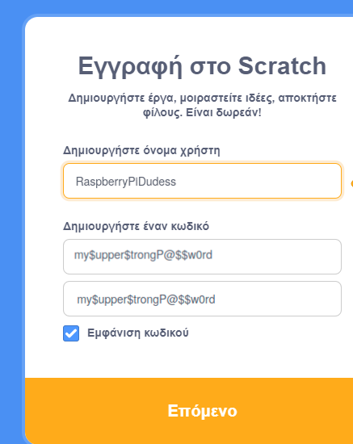

## Create a Scratch account

- Go to [scratch.mit.edu](https://scratch.mit.edu).

- Click on **Join Scratch** in the menu.

- A **Join Scratch** dialog box will open. Create a new username, and make sure that it is not your real name. Then, create a strong password, with a mix of characters, numbers, and symbols. Then, click on **Next**.

- Choose the country you live in from the drop-down menu, then click on **Next**.

- Select the month and year you were born. Then, click on **Next**

- If you like, select your gender.

- Type in your email address, or the email address of a parent.

- Click on **Create Your Account**.

- Click on **Get Started**.

- At some point, you will need to go to your email inbox and confirm your email address.

