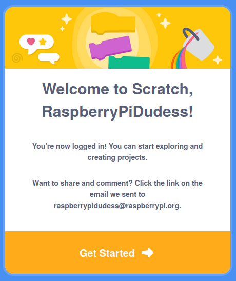

## Create a Scratch account

- Go to [scratch.mit.edu](https://scratch.mit.edu)

- Click on the **Join Scratch** option in the menu.

- Create a new username, and make sure it's not you real name. Then create a strong password, mixing characters, numbers and symbols. Then click on **Next**

- Choose the country you live in from the drop down menu and then click on **Next**

- Select the month and year you were born

- Select your gender or, if you prefer, don't.

- Type in your email address, or the email address of a parent.

- Click on **Create Your Account**

- Click on **Get Started**

- At some point you will need to go to your email and confirm your email account.

