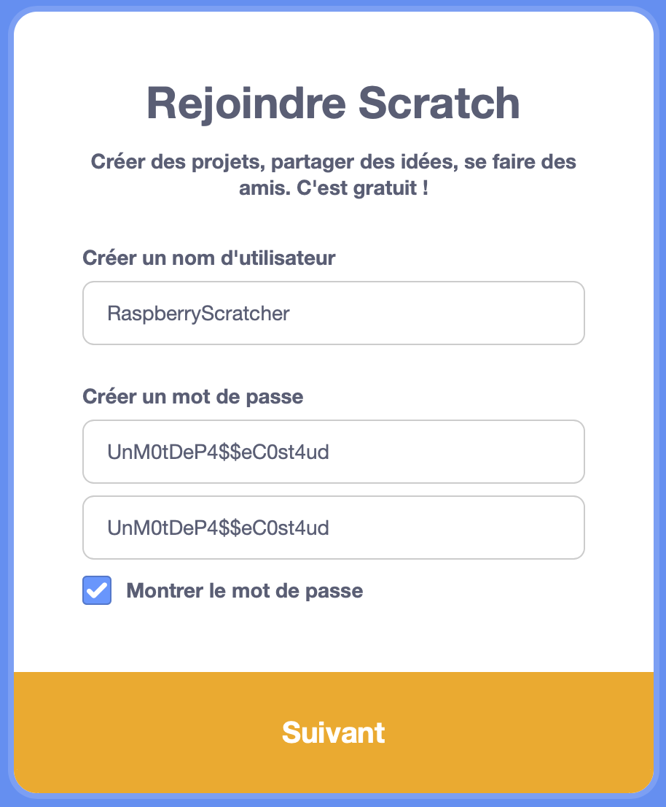
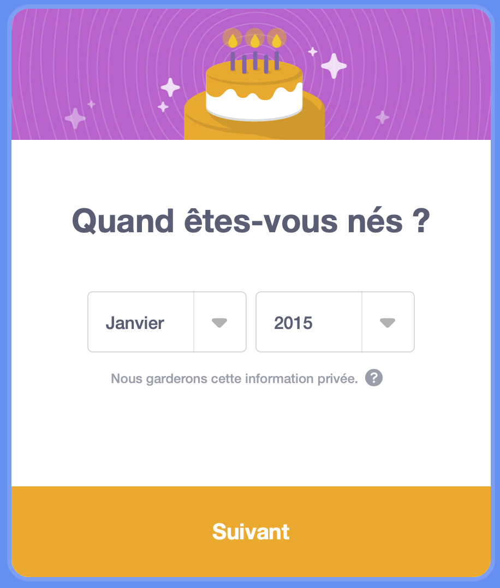
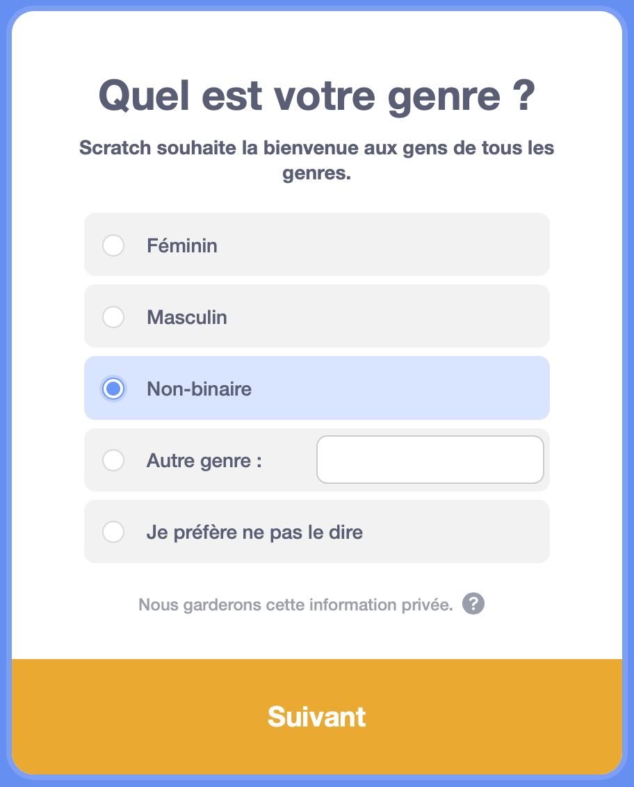
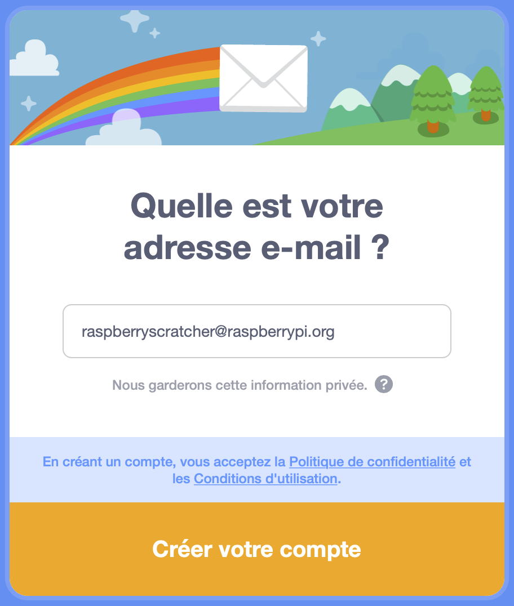
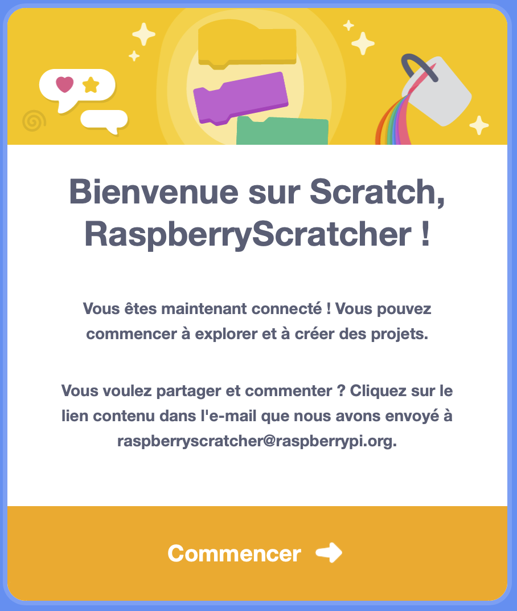

## Créer un compte Scratch

- Rends-toi sur [scratch.mit.edu](https://scratch.mit.edu).

- Click on **Join Scratch** in the menu.

- A **Join Scratch** dialog box will open. Create a new username, and make sure that it is not your real name. Then, create a strong password, with a mix of characters, numbers, and symbols. Ensuite, clique sur **Suivant**.

- Choisis le pays dans lequel tu vis dans le menu déroulant, puis clique sur **Suivant**.

- Sélectionne le mois et l'année de ta naissance. Ensuite, clique sur **Suivant**

- If you like, select your gender.

- Saisis ton adresse email, ou l'adresse email d'un parent.

- Clique sur **Créer votre compte**.

- Clique sur **Commencer**.

- At some point, you will need to go to your email inbox and confirm your email address.

