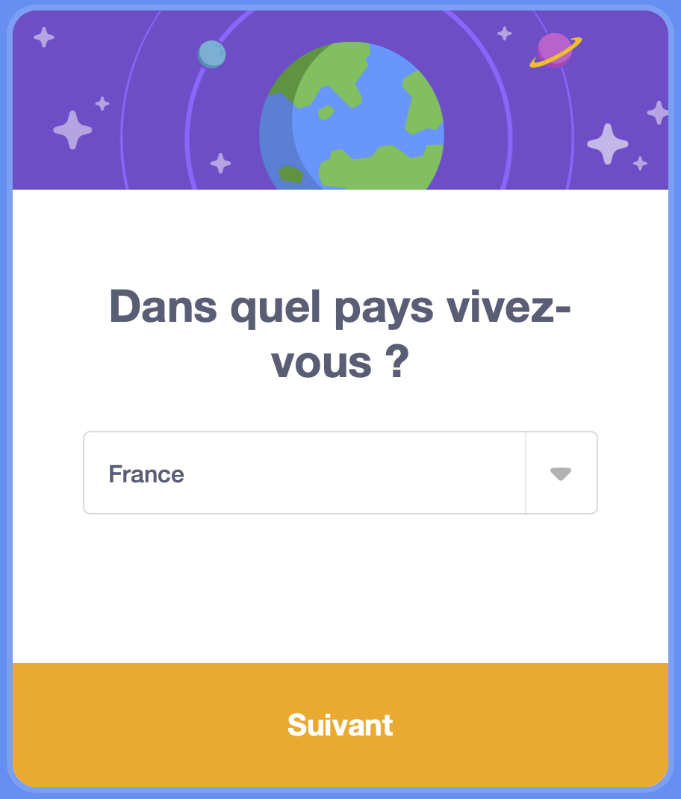

## Créer un compte Scratch

- Rends-toi sur [scratch.mit.edu](https://scratch.mit.edu)

- Clique sur l'option **Rejoindre Scratch** dans le menu.

- Crée un nouveau nom d'utilisateur et assure-toi que ce n'est pas ton vrai nom. Ensuite, choisis un mot de passe fort, en mélangeant des caractères, des nombres et des symboles. Ensuite, clique sur **Suivant**

- Choisis le pays dans lequel tu vis dans le menu déroulant, puis clique sur **Suivant**

- Sélectionne le mois et l'année de ta naissance

- Choisis ton genre ou, si tu préfères, ne le fais pas.

- Saisis ton adresse email, ou l'adresse email d'un parent.

- Clique sur **Créer votre compte**

- Clique sur **Commencer**

- À un moment donné, tu devras accéder à ta messagerie et confirmer ton compte email.

