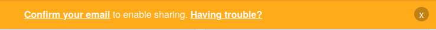

## Create a Scratch account

- [scratch.mit.edu](https://scratch.mit.edu) पर जाएं।

- मेन्यू में **Join Scratch** पर क्लिक करें।

- एक **Join Scratch** डायलॉग बॉक्स खुलेगा। एक नया यूजरनेम बनाएं, और सुनिश्चित करें कि यह आपका वास्तविक नाम नहीं है। फिर, अक्षरों, संख्याओं और प्रतीकों के मिश्रण के साथ एक मजबूत पासवर्ड बनाएं। फिर **Next** पर क्लिक करें।

- ड्रॉप-डाउन मेनू से वह देश चुनें जिसमें आप रहते हैं, फिर **Next** पर क्लिक करें।

- आप जिस महीने और साल में पैदा हुए थे, उसे चुनें। फिर, **Next** पर क्लिक करें।

- यदि आप चाहें, तो अपने लिंग का चयन करें।

- अपना ईमेल पता, या माता-पिता का ईमेल पता टाइप करें।

- **Create Your Account** पर क्लिक करें।

- **Get Started** पर क्लिक करें।

- किसी बिंदु पर, आपको अपने ईमेल इनबॉक्स में जाना होगा और अपने ईमेल एड्रेस की पुष्टि करनी होगी।

