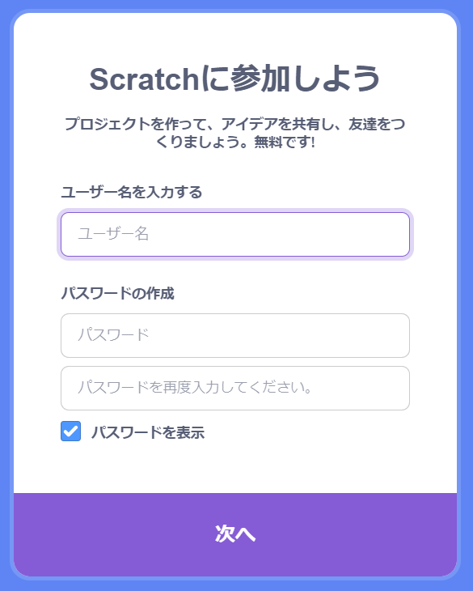
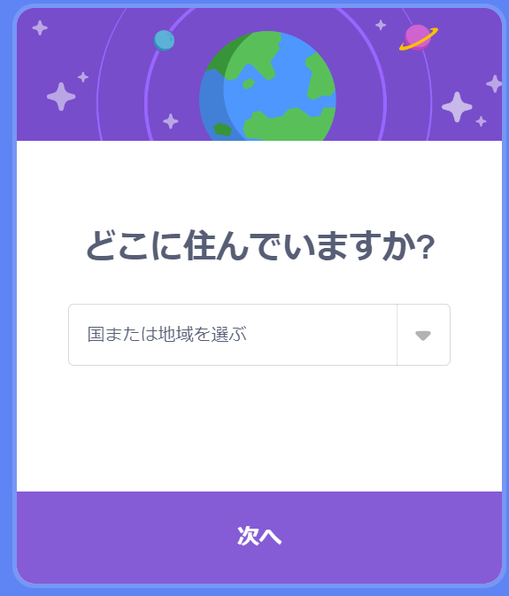
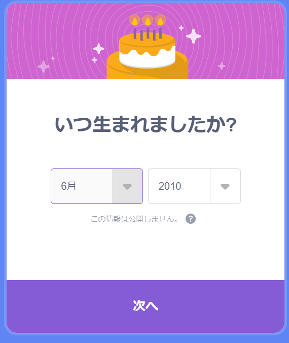
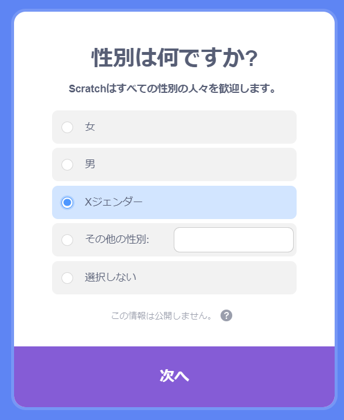
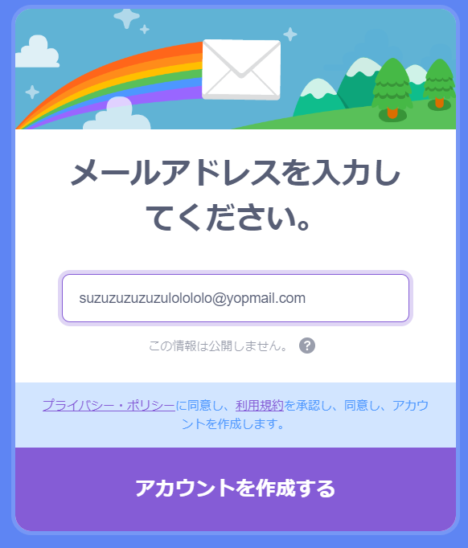
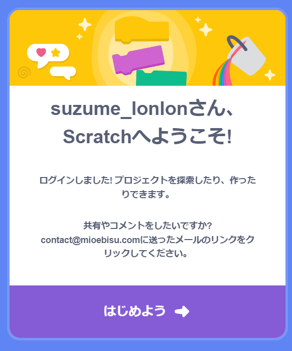
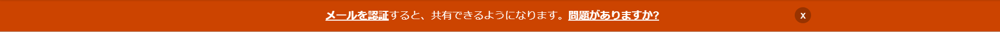

## Scratchアカウントを作成しよう

- [Scratch.mit.edu](https://scratch.mit.edu)にアクセス。

- メニューの **「Scratchに参加しよう」** をクリック。

- **「Scratchに参加しよう」** というダイアログ ボックスが開きます。 新しいユーザー名を作成しましょう。本名は絶対に使わないでね。 次に、文字、数字、記号を組み合わせた強力なパスワードを作成します。 そして **「次へ」**をクリックします。

- ドロップダウン メニューから住んでいる国を選択し、 **「次へ」**をクリックします。

- 生まれた月と年を選択してください。 そして **「次へ」**をクリックします。

- もしよければ性別を選択してください。

- 自分のメールアドレス、またはおうちの方のメールアドレスを入力します。

- **「アカウントを作成する」**をクリックします。

- **「はじめよう」**をクリックします。

- その後に、メールの受信トレイからメールアドレスを認証してください。

