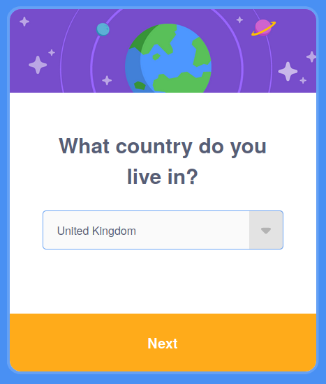
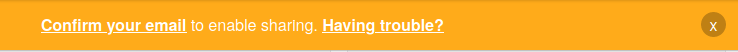

## Scratch ಖಾತೆಯನ್ನು ರಚಿಸಿ

- [scratch.mit.edu](https://scratch.mit.edu) ಗೆ ಹೋಗಿ.

- ಮೆನುನಲ್ಲಿ **Join Scratch** ಆಯ್ಕೆಯ ಮೇಲೆ ಕ್ಲಿಕ್‌ ಮಾಡಿ.

- **Join Scratch** ಡೈಲಾಗ್‌ ಪೆಟ್ಟಿಗೆ ತೆರೆಯುತ್ತದೆ. ಹೊಸ ಯೂಸರ್‌ನೇಮ್‌ ರಚಿಸಿ ಮತ್ತು ಅದು ನಿಮ್ಮ ನಿಜವಾದ ಹೆಸರಲ್ಲ ಎಂದು ಖಚಿತಪಡಿಸಿಕೊಳ್ಳಿ. ನಂತರ ಕ್ಯಾರಕ್ಟರ್‌ಗಳು, ಸಂಖ್ಯೆಗಳು ಮತ್ತು ಸಿಂಬಲ್‌ಗಳನ್ನು ಮಿಶ್ರಮಾಡಿ ಬಲಿಷ್ಠ ಪಾಸ್‌ವರ್ಡ್‌ ರಚಿಸಿ. ನಂತರ **Next** ಮೇಲೆ ಕ್ಲಿಕ್‌ ಮಾಡಿ

- ಡ್ರಾಪ್ ಡೌನ್‌ ಮೆನುನಿಂದ ನೀವು ವಾಸಿಸುವ ದೇಶವನ್ನು ಆಯ್ಕೆ ಮಾಡಿಕೊಳ್ಳಿ ಮತ್ತು ನಂತರ **Next** ಮೇಲೆ ಕ್ಲಿಕ್‌ ಮಾಡಿ

- ನೀವು ಹುಟ್ಟಿರುವ ತಿಂಗಳು ಮತ್ತು ವರ್ಷವನ್ನು ಆಯ್ಕೆ ಮಾಡಿಕೊಳ್ಳಿ ನಂತರ **Next** ಮೇಲೆ ಕ್ಲಿಕ್‌ ಮಾಡಿ

- ನೀವು ಬಯಸಿದರೆ, ನಿಮ್ಮ ಲಿಂಗವನ್ನು ಆಯ್ಕೆಮಾಡಿ.

- ನಿಮ್ಮ ಇ-ಮೇಲ್‌ ಅಡ್ರೆಸ್‌, ಅಥವಾ ನಿಮ್ಮ ಪೋಷಕರ ಇ-ಮೇಲ್‌ ಅಡ್ರೆಸ್‌ ಟೈಪ್‌ ಮಾಡಿ.

- **Create Your Account** ಮೇಲೆ ಕ್ಲಿಕ್‌ ಮಾಡಿ

- **Get Started** ಮೇಲೆ ಕ್ಲಿಕ್‌ ಮಾಡಿ

- ಸದ್ಯದಲ್ಲಿ ಯಾವಾಗಲಾದರೂ ನೀವು ನಿಮ್ಮ ಇ-ಮೇಲ್‌ಗೆ ಹೋಗಿ ನಿಮ್ಮ ಇ-ಮೇಲ್‌ ಖಾತೆಯನ್ನು ದೃಢೀಕರಿಸಬೇಕು.

