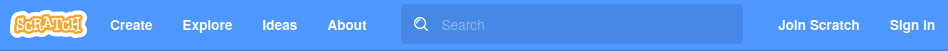
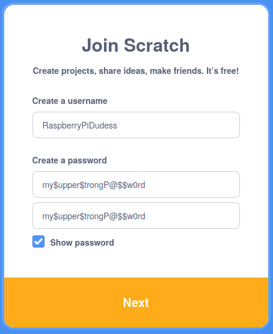
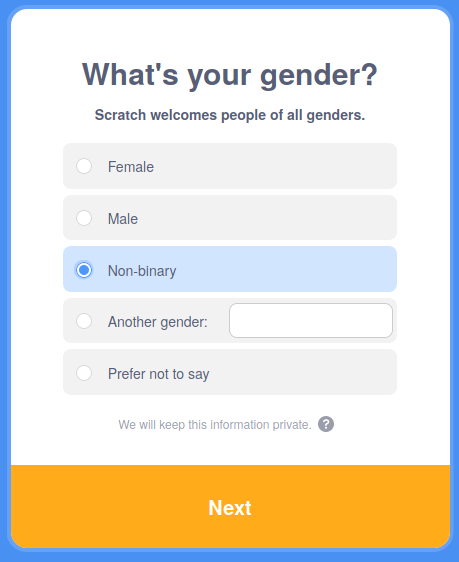
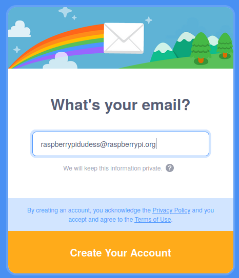

## Scratch अकाऊंट तयार करा

- [scratch.mit.edu](https://scratch.mit.edu) वर जा.

- मेनू मधील **Join Scratch** वर क्लिक करा.

- **Join Scratch** डायलॉग बॉक्स उघडेल. नवीन युरनेम (username) तयार करा, आणि ते तुमचे खरे नाव नसेल याची खात्री करा. त्यानंतर, कॅरेक्टर, नंबर, आणि सिम्बॉल एकत्र करून स्ट्राँग पासवर्ड तयार करा. नंतर **Next** वर क्लिक करा.

- ड्रॉप-डाऊन मेनू मधून तुम्ही रहात असलेला देश निवडा, त्यानंतर **Next** वर क्लिक करा.

- तुमचा जन्म झाला तो महिना आणि वर्ष निवडा. त्यानंतर, **Next** वर क्लिक करा

- तुम्हाला आवडत असल्यास, तुम्ही स्त्री आहात की पुरूष (gender) ते निवडा.

- तुमचा ईमेल ऍड्रेस, किंवा पालकांचा ईमेल ऍड्रेस टाईप करा.

- **Create Your Account** वर क्लिक करा.

- **Get Started** वर क्लिक करा.

- काही क्षणी, तुम्हाला तुमच्या ईमेल इनबॉक्समध्ये जाऊन तुमचा ईमेल ऍड्रेस कंफर्म करावा लागेल.

