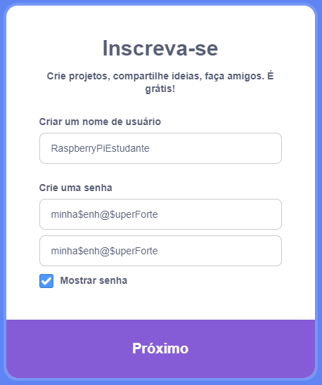
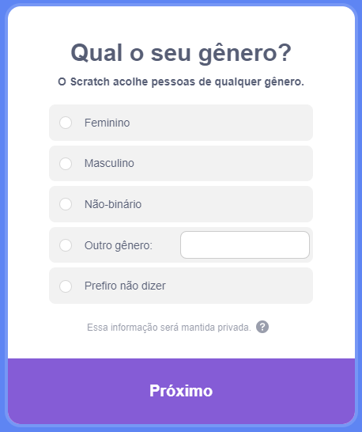
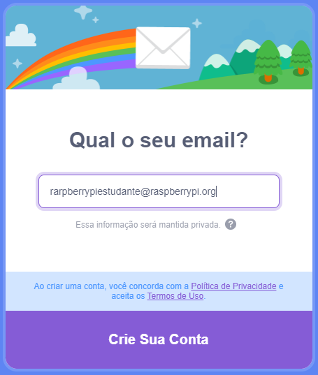

## Crie uma conta Scratch

- Acesse [scratch.mit.edu](https://scratch.mit.edu).

- Clique em **Inscreva-se** no menu.

- Uma caixa de diálogo **Inscreva-se** será aberta. Crie um novo nome de usuário e certifique-se de que não seja seu nome verdadeiro. Em seguida, crie uma senha forte, com uma mistura de caracteres, números e símbolos. Em seguida, clique em **Próximo**.

- Escolha o país em que você mora no menu suspenso e clique em **Próximo**.

- Selecione o mês e o ano em que você nasceu. Em seguida, clique em **Próximo**

- Se desejar, selecione seu gênero.

- Digite seu endereço de e-mail ou o endereço de e-mail de um dos seus pais.

- Clique em **Crie sua conta**.

- Clique em **Começar**.

- Em algum momento, você precisará ir até sua caixa de entrada de e-mail e confirmar seu endereço de e-mail.

