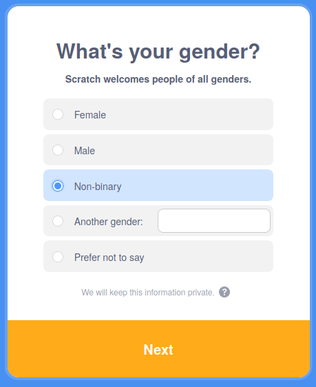
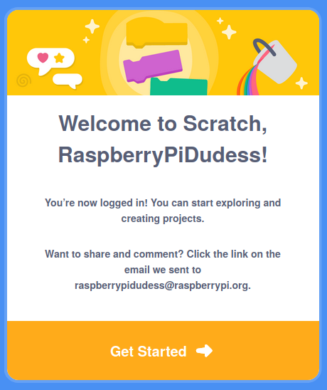

## Scratch ఖాతాను సృష్టించండి

- [scratch.mit.edu](https://scratch.mit.edu) కి వెళ్లండి.

- మెనులో **Join Scratch** పై క్లిక్ చేయండి.

- **Join Scratch** డైలాగ్ బాక్స్ తెరవబడుతుంది. కొత్త యూజర్ ను సృష్టించండి మరియు అది మీ అసలు పేరు కాదని నిర్ధారించుకోండి. ఆపై, అక్షరాలు, సంఖ్యలు మరియు చిహ్నాల మిశ్రమంతో బలమైన పాస్‌వర్డ్‌ను సృష్టించండి. తరువాత, **Next**పై క్లిక్ చేయండి.

- డ్రాప్-డౌన్ మెను నుండి మీరు నివసిస్తున్న దేశాన్ని ఎంచుకుని, ఆపై **Next**పై క్లిక్ చేయండి.

- మీరు పుట్టిన నెల మరియు సంవత్సరాన్ని ఎంచుకోండి. తరువాత, **Next**పై క్లిక్ చేయండి

- మీకు ఇష్టమైతే, మీ జెండర్ ను ఎంచుకోండి.

- మీ ఇమెయిల్ చిరునామా లేదా తల్లిదండ్రుల ఇమెయిల్ చిరునామాను టైప్ చేయండి.

- **Create Your Account** పై క్లిక్ చేయండి.

- **Get Started** పై క్లిక్ చేయండి.

- ఏదో ఒక సమయంలో, మీరు మీ ఇమెయిల్ ఇన్‌బాక్స్‌కి వెళ్లి మీ ఇమెయిల్ చిరునామాను నిర్ధారించాలి.

