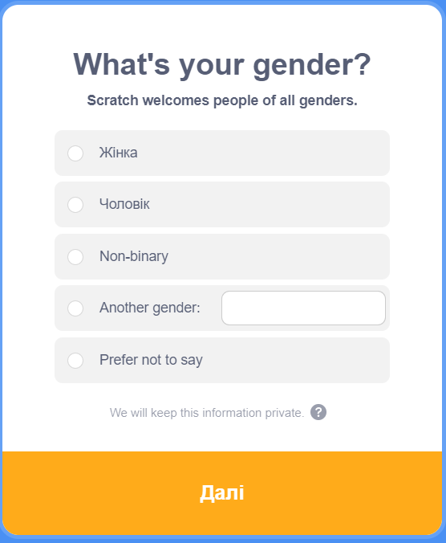

## Створення облікового запису Scratch

- Відкрий сторінку [scratch.mit.edu](https://scratch.mit.edu).

- Натисни **Приєднатись** в меню.

- Відкриється діалогове вікно **Приєднатись**. Створи нове ім'я користувача і зверни увагу, щоб воно не було твоїм справжнім ім'ям. Потім придумай надійний пароль, який складається з комбінації літер, цифр та символів. Потім натисни **Далі**.

- У розкривному меню вибери країну, в якій проживаєш, а потім натисни **Далі**.

- Вибери місяць та рік свого народження. Потім натисни **Далі**

- Обери стать (не обов’язково).

- Введи свою адресу електронної пошти або адресу електронної пошти одного з батьків.

- Натисни **Створити обліковий запис**.

- Натисни **Почати роботу**.

- Після цього тобі потрібно буде зайти у свою електронну пошту та підтвердити свою електронну адресу.

